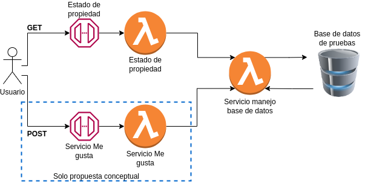
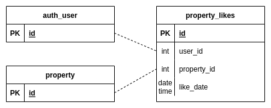

# César A. Villegas T.
# Hola. Este es el test de backed dev de habi

## Tecnologías a emplear.

Para esta prueba se van a utilizar:
* Python como lenguaje principal.
* AWS (cuenta de pruebas propia).
* AWS CDK como framework para definir recursos requeridos (infra como cod.).
* Arquitectura serverless basada en AWS ApiGateway y funciones Lambda.
* Pytest para pruebas unitarias.

## Procedimiento a seguir.

* Definición básica de la infraestructura con AWS CDK.
* Esquema de pruebas.
* Desarrollo de servicio para acceso a base de datos.
* Desarrollo de servicio para consultar estado de la propiedad.
* Propuesta para soportar requerimiento de servicio "Me gusta".

# 1- Servicio de consulta
## URL del servicio
* URL: https://nn3ujmde03.execute-api.us-east-1.amazonaws.com/prod/estates
* Verbo HTTP: GET
* filtros disponibles: `city=$city_name` - `year=$year` - `status=$property_status`

* Ejemplos de peticiones con filtros:
    - https://nn3ujmde03.execute-api.us-east-1.amazonaws.com/prod/estates?city=bogota&year=2011&status=pre_venta
    - https://nn3ujmde03.execute-api.us-east-1.amazonaws.com/prod/estates?city=bogota

* Ejemplo de respuesta:
    [
        {
            "address": "carrera 100 #15-90w",
            "city": "bogota",
            "status": "pre_venta",
            "price": 350000000,
            "description": "Amplio apartamento en conjunto cerrado"
        }
    ]

# 2- Servicio de "Me gusta"

## Extención modelo de datos

Para este proceso es necesario agregar una tabla intermedia entre la tabla de usuarios y
la tabla de propiedades, de manera que se agregue un registro con cada "me gusta".
Es importante dejar un registro de la fecha en la que se hace el "me gusta" para
mantener mejor control y facilitar procesos de recuperación de información en caso
de daños.

## Desarrollo del servicio de "Me gusta"
Expondría un endpoint en el que, a través de una petición POST se puedan recibir un body
con una estructura de tipo:

    {
        "user_id": "123"
        "property_id": "456"
    }

Bastaría entonces con verificar que el body venga completo y realizar el proceso de inserción
a base de datos. 

Para posteriores búsquedas y mantener integridad en la información, es recomendable agregar un indice
entre user_id y property_id, y garantizar que no se puedan insertar registros en la tabla
con user_id y property_id duplicados. 

## Código SQL

`CREATE TABLE "property_likes" ("id" int(11) NOT NULL AUTO_INCREMENT, "user_id" int(11) NOT NULL "property_id" int(11) NOT NULL, "like_date" datetime NOT NULL DEFAULT CURRENT_TIMESTAMP, PRIMARY KEY ("id"), UNIQUE KEY "property_likes_id_uindex" ("id"), KEY "property_likes_user_id_fk" ("user_id"), KEY "property_likes_property_id_fk" ("property_id"), CONSTRAINT "property_likes_user_id_fk" FOREIGN KEY ("user_id") REFERENCES "auth_user" ("id"), CONSTRAINT "property_likes_property_id_fk" FOREIGN KEY ("property_id") REFERENCES "property" ("id")) ENGINE=InnoDB AUTO_INCREMENT=1 DEFAULT CHARSET=latin1;`